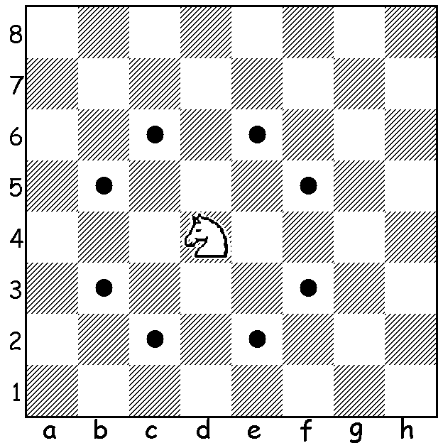

# Knights Travails TOP

Project for The Odin Project (TOP). 
The objective is to test algorithm and data structures knowledge and use it to build a script that will find the shortest path between two nodes.  

<strong>Knight Traveils</strong> is an exercise set up on a classic chess board, size of 8x8, with only our knight in it.  
The knight has a function with 2 parameters, start point and end point.
Given these parameters, the function will determine the shortest path between them, print how many moves and which cells where used.  

#

Assignment

  <h3><a href="#assignment" class="anchor-link">Assignment</a></h3>
  
Your task is to build a function <code>knightMoves</code> that shows the shortest possible way to get from one square to another by outputting all squares the knight will stop on along the way.

  
You can think of the board as having 2-dimensional coordinates.  Your function would therefore look like:

  <ul>
    <li><code>knightMoves([0,0],[1,2]) == [[0,0],[1,2]]</code></li>
    <li><code>knightMoves([0,0],[3,3]) == [[0,0],[1,2],[3,3]]</code></li>
    <li><code>knightMoves([3,3],[0,0]) == [[3,3],[1,2],[0,0]]</code></li>
  </ul>

  

    <ol>
      <li>Put together a script that creates a game board and a knight.</li>
      <li>Treat all possible moves the knight could make as children in a tree.  Don’t allow any moves to go off the board.</li>
      <li>Decide which search algorithm is best to use for this case.  Hint: one of them could be a potentially infinite series.</li>
      <li>Use the chosen search algorithm to find the shortest path between the starting square (or node) and the ending square.  Output what that full path looks like, e.g.:</li>
    </ol>
    
    > knightMoves([3,3],[4,3]);
    => You made it in 3 moves! Here's your path:
    [3,3]
    [4,5]
    [2,4]
    [4,3]

    
    
  

  

